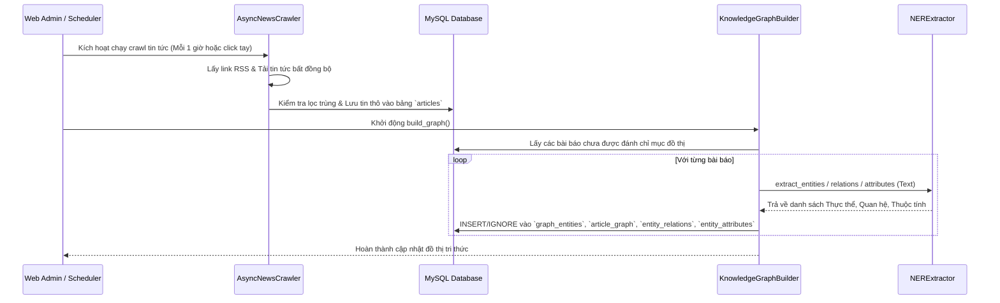
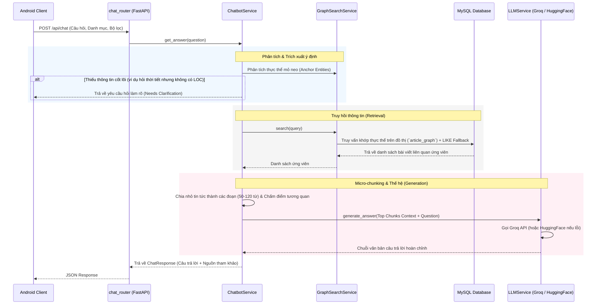

# TÀI LIỆU TÌM HIỂU DỰ ÁN: NEWS CHATBOT SYSTEM

Tài liệu này cung cấp cái nhìn tổng quan và chi tiết về toàn bộ dự án Chatbot Tin Tức (News Chatbot System). Dự án sử dụng mô hình RAG (Retrieval-Augmented Generation) kết hợp với **Knowledge Graph (Đồ thị Tri thức)** được lưu trữ và truy vấn trực tiếp trên Relational Database để nâng cao khả năng hiểu và trả lời câu hỏi dựa trên mối quan hệ giữa các thực thể tin tức.

---

## 1. TỔNG QUAN CÔNG NGHỆ
- **Backend / API Framework:** FastAPI (Python).
- **Database:**
  - **MySQL (Core & Graph Database):** Đóng vai trò kép. Lưu trữ các bài viết thô (bảng `articles`) và lưu trữ toàn bộ Đồ thị Tri thức (các bảng `graph_entities`, `article_graph`, `entity_relations`, `entity_attributes`). Runtime Chatbot truy vấn trực tiếp trên các bảng MySQL này để tìm kiếm đồ thị (Graph Search).
  - **Neo4j:** Đồ thị Tri thức phục vụ trực quan hóa học thuật/quản trị (Cấu hình kết nối trong `.env`, không tham gia vào luồng truy vấn trực tiếp của Chatbot ở runtime để tối ưu hóa hiệu năng).
- **AI / LLM:** 
  - **Groq API (Primary):** Sử dụng mô hình `llama-3.3-70b-versatile` làm LLM chính nhờ tốc độ phản hồi cực nhanh.
  - **Hugging Face Inference API (Fallback):** Sử dụng mô hình `mistralai/Mistral-7B-Instruct-v0.2` làm phương án dự phòng khi Groq quá tải hoặc lỗi.
- **NLP / NER (Tiếng Việt):** Tự phát triển (`CustomVietnameseTokenizer` sử dụng thuật toán MaxMatch, kết hợp bộ luật Regex và từ điển Lexicons trong `ner_extractor.py`) giúp hệ thống nhẹ, xử lý nhanh và không cần các thư viện AI nặng nề bên thứ ba.
- **Client App:** Native Android (Kotlin/Java, xây dựng bằng hệ thống Gradle).
- **Web Admin Interface:** Jinja2 HTML Templates + Tailwind CSS / Vanilla CSS.

---

## 2. KIẾN TRÚC & CẤU TRÚC THƯ MỤC CHÍNH

Dự án được phân chia thành các thư mục chức năng rõ ràng:
- `start_project.py` / `start.bat`: Khởi chạy uvicorn server và tự động đồng bộ hóa URL ngrok với Client Android.
- `etl/`: Module thu thập và phân tích dữ liệu tin tức thô.
- `pipeline/`: Pipeline phân tách NLP và xây dựng cấu trúc Đồ thị Tri thức vào MySQL.
- `chatbot_api/`: API chatbot, logic RAG, tìm kiếm đồ thị, mở rộng truy vấn và giao tiếp với LLM Providers.
- `web_admin/`: Trang quản trị dành cho Admin, hiển thị danh sách tin tức, thống kê và điều khiển cào dữ liệu.
- `apps/android/`: Mã nguồn ứng dụng Client Native Android.

---

## 3. CHI TIẾT CHỨC NĂNG CÁC FILE & MODULE

### 3.1. Trình khởi chạy hệ thống (Entry Points)
- **`start.bat`**: File kịch bản của Windows hỗ trợ kích hoạt nhanh dự án chỉ bằng một cú click chuột (kiểm tra Python, cài đặt thư viện và gọi `start_project.py`).
- **`start_project.py`**: Điểm điều phối trung tâm.
  - *Chức năng:* Thiết lập tunnel qua Ngrok để tạo URL công khai, tự động cập nhật URL này vào file `.env` (cho Backend) và file `apps/android/gradle.properties` (cho Client Android), sau đó chạy FastAPI qua uvicorn trên cổng `8000`.

### 3.2. Module `etl/` (Extract - Transform - Load)
- **`crawler.py` (`AsyncNewsCrawler`):** Sử dụng thư viện `aiohttp` để tải bất đồng bộ nội dung từ các đường link báo mạng (tiêu đề, tóm tắt, nội dung, nguồn tin).
- **`rss_parser.py`**: Trích xuất danh sách link bài viết mới từ các kênh RSS chính thống (VNExpress, Thanh niên, Tuổi trẻ...).
- **`deduplicator.py`**: Kiểm tra và loại bỏ các tin tức bị trùng lặp tiêu đề hoặc đường dẫn trước khi lưu trữ.
- **`loader.py` (`DatabaseLoader`):** Chịu trách nhiệm tạo bảng `articles` và thực hiện chèn dữ liệu hàng loạt (Bulk Insert) kèm theo cơ chế cập nhật khi trùng khóa (`ON DUPLICATE KEY UPDATE`).
- **`ner_extractor.py` (`NERExtractor`):** Chứa tập hợp quy tắc Regex và từ điển thực thể khổng lồ để bóc tách các thực thể (`PERSON`, `ORG`, `LOC`, `DATE`, `PRODUCT`, `EVENT`...) cũng như các thuộc tính (`TREND`, `STATE`) và mối quan hệ giữa chúng.
- **`scripts/main_etl.py`**: Script chạy tay độc lập dùng để chạy tiến trình cào tin và cập nhật đồ thị mà không cần mở giao diện Web Admin.

### 3.3. Module `pipeline/` (NLP & Graph Builder)
- **`nlp_processor.py`**:
  - *Chức năng:* Làm sạch văn bản (xóa HTML, URL, icon, chuẩn hóa Unicode tiếng Việt). Tích hợp `CustomVietnameseTokenizer` sử dụng thuật toán **MaxMatch** để tách từ tiếng Việt dựa trên từ từ điển thô, đồng thời lọc bỏ các từ dừng (Stopwords).
- **`knowledge_graph_builder.py` (`KnowledgeGraphBuilder`):** Cầu nối chuyển đổi văn bản sang đồ thị tri thức.
  - *Chức năng:* Khởi tạo các bảng đồ thị trong MySQL. Quét nội dung các bài viết mới, gọi `NERExtractor` để bóc tách thực thể/mối quan hệ/thuộc tính và lưu chúng vào cơ sở dữ liệu MySQL một cách tuần tự.
- **`config.py`**: Lưu trữ thông tin kết nối MySQL dùng riêng cho pipeline.

### 3.4. Module `chatbot_api/` (Core RAG Engine)
- **`main.py` & `routers/chat.py`**: Định nghĩa endpoint API `/api/chat` tiếp nhận câu hỏi của người dùng và chuyển tiếp tới dịch vụ nghiệp vụ chatbot.
- **`dependencies.py`**: Quản lý Dependency Injection (DI) theo dạng Singleton. Khởi tạo `LLMService` với cơ chế dự phòng `FallbackLLMProvider` (Groq làm chính, Hugging Face làm phụ).
- **`services/chatbot_service.py`**: Điều phối luồng xử lý RAG.
  - *Chức năng:* Phân tích câu hỏi -> Nhận diện câu hỏi thiếu thông tin cần làm rõ (ví dụ: hỏi thời tiết nhưng thiếu địa điểm) -> Gọi truy tìm đồ thị -> Thực hiện **Micro-chunking** (cắt nhỏ văn bản thành đoạn 50-120 từ để tránh vượt quá giới hạn token) -> Chấm điểm độ tương quan của các chunk -> Gọi LLM tạo câu trả lời.
- **`services/graph_search_service.py` (`GraphSearchService`):**
  - *Chức năng:* Chuyển đổi câu hỏi của người dùng thành các từ khóa/thực thể tìm kiếm, thực hiện truy vấn kết hợp (Hybrid Retrieval) giữa tìm kiếm đồ thị trên MySQL (`article_graph`, `graph_entities`) và tìm kiếm văn bản tự do (Full-text LIKE fallback).
- **`services/query_expansion_service.py`**: Viết lại và mở rộng câu hỏi ngắn bằng LLM trước khi thực hiện tìm kiếm để tăng độ chính xác (ví dụ: "giá vàng" -> "Giá vàng hôm nay tại Việt Nam biến động như thế nào?").
- **`services/llm_service.py`**: Lớp trừu tượng hóa LLM Providers. Cung cấp Prompt kỹ thuật chi tiết ép buộc LLM chỉ trả lời dựa vào ngữ cảnh đi kèm và tuân thủ các quy tắc chặt chẽ về định dạng, thông tin lịch sử.

### 3.5. Module `web_admin/` (Web Dashboard)
- **`main.py`**: Thiết lập ứng dụng quản trị FastAPI chính, tích hợp module chatbot, mount static/template và chạy khởi tạo cấu trúc DB lúc startup.
- **`routes/news.py`**:
  - *Chức năng:* Hiển thị danh sách tin tức phân trang, trang chi tiết bài viết kèm dữ liệu thực thể/mối quan hệ đồ thị đi kèm, thống kê tin tức. Hỗ trợ kích hoạt tiến trình cào tin ngầm (`BackgroundTasks`) và xóa bài báo (khi xóa bài báo, nhờ cấu hình khóa ngoại `ON DELETE CASCADE` trên MySQL, các nút quan hệ đồ thị gắn liền bài viết đó cũng sẽ tự động được dọn dẹp sạch sẽ).
- **`utils/db.py`**: Các hàm tương tác trực tiếp với MySQL phục vụ giao diện Admin (như `get_all_news`, `delete_article`, `get_statistics`, `ensure_articles_schema`...).
- **`templates/` & `static/`**: Giao diện người dùng vẽ bằng Jinja2, CSS và Javascript.

---

## 4. LUỒNG HOẠT ĐỘNG CHI TIẾT (SYSTEM WORKFLOWS)

### Luồng 1: Thu thập & Cập nhật đồ thị tri thức (ETL & Graph Build)

### Luồng 2: Xử lý câu hỏi người dùng (Chatbot RAG Flow)

### Luồng 3: Luồng Khởi chạy & Điều hướng Dự án (Startup & Runtime Code Flow)

Phần này mô tả đầy đủ hơn quan hệ **file nào gọi file nào** trong dự án. Các file cấu hình, template, schema và model cũng được liệt kê để khi đọc code có thể đi từ entry point đến từng lớp xử lý cụ thể.

```mermaid
graph TD
    %% Root startup
    A[start.bat] -->|gọi| B[start_project.py]
    B -->|đọc/cập nhật| C[.env]
    B -->|cập nhật URL Android| D[apps/android/gradle.properties]
    B -->|subprocess: uvicorn web_admin.main:app| E[web_admin/main.py]

    %% FastAPI web admin
    E -->|import router| F[web_admin/routes/news.py]
    E -->|import router| G[chatbot_api/routers/chat.py]
    E -->|startup gọi| H[web_admin/utils/db.py]
    E -->|startup gọi DI| I[chatbot_api/dependencies.py]
    E -->|mount| J[web_admin/static/css/style.css]
    E -->|mount| K[web_admin/static/js/main.js]

    F -->|render| T1[web_admin/templates/index.html]
    F -->|render| T2[web_admin/templates/news_list.html]
    F -->|render| T3[web_admin/templates/news_detail.html]
    F -->|render lỗi| T4[web_admin/templates/404.html]
    T1 -->|extends| TB[web_admin/templates/base.html]
    T2 -->|extends| TB
    T3 -->|extends| TB
    T4 -->|extends| TB
    TB -->|load CSS| J
    TB -->|load JS| K
    T1 -->|fetch POST /api/refresh-news| F
    T2 -->|fetch DELETE /api/news/id| F

    %% Admin refresh -> ETL -> Graph
    F -->|_run_rss_refresh import| L[etl/crawler.py]
    F -->|_run_rss_refresh import| M[pipeline/knowledge_graph_builder.py]
    F -->|clear_service_caches| I
    F -->|query bài viết/đồ thị| H
    H -->|đọc MYSQL_CONFIG| N[pipeline/config.py]
    H -->|CRUD| DB[(MySQL)]

    L -->|dùng model| L0[etl/models.py]
    L -->|parse RSS| L1[etl/rss_parser.py]
    L -->|chọn extractor| L2[etl/extractors.py]
    L -->|lọc trùng| L3[etl/deduplicator.py]
    L -->|lưu DB| L4[etl/loader.py]
    L1 -->|tạo Article| L0
    L2 -->|trả nội dung đầy đủ| L
    L3 -->|nhận Article| L0
    L4 -->|đọc MYSQL_CONFIG| N
    L4 -->|INSERT articles| DB

    M -->|đọc MYSQL_CONFIG| N
    M -->|trích xuất NER| O[etl/ner_extractor.py]
    O -->|nạp lexicon| O1[data/ner_lexicons*.json]
    O -->|nạp titlecase lexicon| O2[data/ner_titlecase_lexicons.json]
    M -->|SELECT articles / INSERT graph_*| DB

    %% Chatbot API
    G -->|validate DTO| P[chatbot_api/schemas/chat.py]
    G -->|Depends get_chatbot_service| I
    G -->|GET /api/categories dùng| H
    I -->|tạo repository| Q[chatbot_api/repositories/article_repository.py]
    Q -->|kế thừa| Q0[chatbot_api/repositories/base.py]
    Q0 -->|đọc MYSQL_CONFIG| N
    Q0 -->|SELECT articles| DB
    I -->|tạo graph search| R[chatbot_api/services/graph_search_service.py]
    I -->|tạo chatbot service| S[chatbot_api/services/chatbot_service.py]
    I -->|tạo LLM provider/service| U[chatbot_api/services/llm_service.py]
    I -->|tạo query expansion| V[chatbot_api/services/query_expansion_service.py]
    S -->|clean_query| W[pipeline/nlp_processor.py]
    S -->|search/search_explicit_date_mentions| R
    S -->|lấy metadata bài viết| Q
    S -->|expand câu hỏi ngắn| V
    V -->|generate_answer timeout| U
    S -->|generate_answer| U
    R -->|analyze_query| O
    R -->|đọc MYSQL_CONFIG| N
    R -->|SELECT graph/articles| DB
    U -->|primary| X[Groq API]
    U -->|fallback| Y[Hugging Face API]

    %% Standalone API entry
    Z[chatbot_api/main.py] -->|include router khi chạy riêng| G

    %% Manual ETL
    AA[scripts/main_etl.py] -->|khởi tạo AsyncNewsCrawler| L

    %% Android client
    AB[apps/android/settings.gradle.kts] -->|include module app| AC[apps/android/app/build.gradle.kts]
    AP[apps/android/local.properties] -->|SDK path local| AC
    AD[apps/android/app/src/main/AndroidManifest.xml] -->|application| AE[ChatApplication.kt]
    AD -->|launcher activity| AF[ChatActivity.kt]
    AC -->|BuildConfig API_BASE_URL| AG[ChatApiService.kt]
    AE -->|tạo Retrofit service| AG
    AE -->|tạo repository| AH[ChatRepository.kt]
    AF -->|inject repository| AI[ChatViewModel.kt]
    AF -->|setContent theme| AJ[ui/theme/Theme.kt]
    AJ -->|dùng màu| AK[ui/theme/Color.kt]
    AF -->|render composable| AL[ChatScreen.kt]
    AL -->|sendMessage/reset/clearError| AI
    AI -->|gọi repository| AH
    AH -->|tạo DTO| AM[ChatModels.kt]
    AH -->|Retrofit POST api/chat| AG
    AG -->|HTTP| G
    AM -->|map JSON request/response| P
```

**Bảng quan hệ file gọi file**

| File nguồn | Gọi / sử dụng file | Vai trò trong luồng |
|---|---|---|
| `start.bat` | `start_project.py` | Entry point Windows, chạy script Python chính. |
| `start_project.py` | `.env`, `apps/android/gradle.properties`, `web_admin/main.py` | Tạo ngrok, cập nhật URL public cho backend/Android, rồi chạy `uvicorn web_admin.main:app`. |
| `web_admin/main.py` | `web_admin/routes/news.py`, `chatbot_api/routers/chat.py` | Tạo FastAPI app và include router web admin + chatbot API. |
| `web_admin/main.py` | `web_admin/utils/db.py`, `chatbot_api/dependencies.py` | Startup khởi tạo schema DB và preload singleton service. |
| `web_admin/main.py` | `web_admin/static/css/style.css`, `web_admin/static/js/main.js` | Mount thư mục static cho giao diện admin. |
| `web_admin/routes/news.py` | `web_admin/utils/db.py` | Lấy danh sách tin, chi tiết tin, thống kê, category, xóa bài viết, lấy entity/relation/attribute của bài. |
| `web_admin/routes/news.py` | `web_admin/templates/index.html`, `news_list.html`, `news_detail.html`, `404.html` | Render các trang admin bằng Jinja2. |
| `web_admin/routes/news.py` | `etl/crawler.py`, `pipeline/knowledge_graph_builder.py` | Khi refresh tin, chạy crawl RSS rồi build/cập nhật knowledge graph. |
| `web_admin/routes/news.py` | `chatbot_api/dependencies.py` | Gọi `clear_service_caches()` sau khi refresh để service nạp lại dữ liệu/lexicon mới. |
| `web_admin/templates/index.html` | `web_admin/routes/news.py` | Gọi `POST /api/refresh-news`, sau đó tự refresh dashboard. |
| `web_admin/templates/news_list.html` | `web_admin/routes/news.py` | Gọi `DELETE /api/news/{news_id}` để xóa bài từ giao diện. |
| `web_admin/templates/index.html`, `news_list.html`, `news_detail.html`, `404.html` | `web_admin/templates/base.html` | Các trang con kế thừa layout chung. |
| `web_admin/templates/base.html` | `web_admin/static/css/style.css`, `web_admin/static/js/main.js` | Nạp CSS/JS dùng chung cho admin. |
| `web_admin/utils/db.py` | `pipeline/config.py`, MySQL | Đọc `MYSQL_CONFIG`, tạo kết nối và thực hiện CRUD trên `articles`, `graph_entities`, `article_graph`, `entity_relations`, `entity_attributes`. |
| `scripts/main_etl.py` | `etl/crawler.py` | Entry point chạy ETL thủ công ngoài Web Admin. |
| `etl/crawler.py` | `etl/rss_parser.py` | Parse từng RSS feed thành danh sách `Article`. |
| `etl/crawler.py` | `etl/extractors.py` | Chọn extractor phù hợp URL và lấy full content bài viết. |
| `etl/crawler.py` | `etl/deduplicator.py` | Lọc bài trùng trong phiên crawl bằng Jaccard/N-gram. |
| `etl/crawler.py` | `etl/loader.py` | Lưu batch bài viết đã crawl vào MySQL. |
| `etl/crawler.py`, `etl/rss_parser.py`, `etl/deduplicator.py`, `etl/loader.py` | `etl/models.py` | Dùng dataclass `Article` làm model trung gian. |
| `etl/rss_parser.py` | RSS URL bên ngoài | Tải XML RSS, đọc title/link/summary/published_date. |
| `etl/extractors.py` | URL bài báo bên ngoài | `ExtractorFactory` trả `VnExpressExtractor`, `DantriExtractor` hoặc `GenericReadabilityExtractor`. |
| `etl/loader.py` | `pipeline/config.py`, MySQL | Đọc cấu hình MySQL, tạo bảng `articles`, insert/update bài viết. |
| `pipeline/knowledge_graph_builder.py` | `pipeline/config.py`, MySQL | Kết nối DB, tạo bảng graph, lấy bài cần xử lý và ghi dữ liệu graph. |
| `pipeline/knowledge_graph_builder.py` | `etl/ner_extractor.py` | Gọi `extract_entities()`, `extract_relations()`, `extract_attributes()` cho từng bài viết. |
| `etl/ner_extractor.py` | `data/ner_lexicons.json`, `data/ner_lexicons_news_domain.json`, `data/ner_lexicons_news_domain.bak.json`, `data/ner_titlecase_lexicons.json` | Nạp từ điển NER mở rộng và từ điển titlecase. |
| `pipeline/nlp_processor.py` | `pipeline/config.py`, MySQL | Có hàm batch xử lý text trong DB; đồng thời cung cấp `clean_query()` cho chatbot. |
| `chatbot_api/main.py` | `chatbot_api/routers/chat.py` | Entry point API riêng nếu chạy module chatbot độc lập. |
| `chatbot_api/routers/chat.py` | `chatbot_api/schemas/chat.py` | Validate request/response bằng Pydantic DTO. |
| `chatbot_api/routers/chat.py` | `chatbot_api/dependencies.py` | Lấy `ChatbotService` và `GraphSearchService` qua FastAPI `Depends`. |
| `chatbot_api/routers/chat.py` | `web_admin/utils/db.py` | Endpoint `/api/categories` đọc category trực tiếp từ MySQL. |
| `chatbot_api/dependencies.py` | `chatbot_api/repositories/article_repository.py` | Tạo singleton repository truy vấn bảng `articles`. |
| `chatbot_api/dependencies.py` | `chatbot_api/services/graph_search_service.py` | Tạo singleton service tìm kiếm graph. |
| `chatbot_api/dependencies.py` | `chatbot_api/services/llm_service.py` | Tạo `GroqProvider`, `HuggingFaceProvider`, `FallbackLLMProvider`, `LLMService`. |
| `chatbot_api/dependencies.py` | `chatbot_api/services/query_expansion_service.py` | Tạo service mở rộng câu hỏi ngắn bằng LLM. |
| `chatbot_api/dependencies.py` | `chatbot_api/services/chatbot_service.py` | Inject repository, graph search, LLM và query expansion vào service điều phối RAG. |
| `chatbot_api/repositories/article_repository.py` | `chatbot_api/repositories/base.py` | Kế thừa base repository để dùng `_fetch_one()`, `_fetch_all()`. |
| `chatbot_api/repositories/base.py` | `pipeline/config.py`, MySQL | Tạo connection context manager và chạy SQL. |
| `chatbot_api/services/chatbot_service.py` | `chatbot_api/schemas/chat.py` | Trả `ChatResponse` và `SearchResult` đúng schema API. |
| `chatbot_api/services/chatbot_service.py` | `pipeline/nlp_processor.py` | Gọi `clean_query()` để chuẩn hóa câu hỏi/từ khóa. |
| `chatbot_api/services/chatbot_service.py` | `chatbot_api/services/graph_search_service.py` | Gọi `search()` và `search_explicit_date_mentions()` để lấy bài ứng viên. |
| `chatbot_api/services/chatbot_service.py` | `chatbot_api/repositories/article_repository.py` | Lấy metadata bài viết theo id khi dựng nguồn tham khảo. |
| `chatbot_api/services/chatbot_service.py` | `chatbot_api/services/query_expansion_service.py` | Mở rộng câu hỏi ngắn trước khi search nếu cần. |
| `chatbot_api/services/chatbot_service.py` | `chatbot_api/services/llm_service.py` | Gửi context + question sang LLM để sinh câu trả lời. |
| `chatbot_api/services/query_expansion_service.py` | `chatbot_api/services/llm_service.py` | Gọi LLM với timeout để viết lại câu hỏi. |
| `chatbot_api/services/graph_search_service.py` | `etl/ner_extractor.py` | Gọi `analyze_query()` để nhận diện entity/date/topic trong câu hỏi. |
| `chatbot_api/services/graph_search_service.py` | `pipeline/config.py`, MySQL | Truy vấn graph (`article_graph`, `graph_entities`) và fallback LIKE trên `articles`. |
| `chatbot_api/services/llm_service.py` | Groq API, Hugging Face API | Provider chính/phụ để sinh response. |
| `apps/android/settings.gradle.kts` | `apps/android/app/build.gradle.kts` | Gradle include module `app`. |
| `apps/android/build.gradle.kts` | `apps/android/app/build.gradle.kts` | Cấu hình plugin/version cấp project cho module Android. |
| `apps/android/app/build.gradle.kts` | `apps/android/gradle.properties`, `apps/android/local.properties`, `apps/android/app/src/main/java/com/chatbot/newsviet/data/api/ChatApiService.kt` | Đọc cấu hình Gradle/local SDK, sinh `BuildConfig.API_BASE_URL` cho Retrofit. |
| `apps/android/app/src/main/AndroidManifest.xml` | `apps/android/app/src/main/java/com/chatbot/newsviet/ChatApplication.kt`, `apps/android/app/src/main/java/com/chatbot/newsviet/ui/ChatActivity.kt` | Khai báo application class và launcher activity. |
| `apps/android/app/src/main/java/com/chatbot/newsviet/ChatApplication.kt` | `apps/android/app/src/main/java/com/chatbot/newsviet/data/api/ChatApiService.kt`, `apps/android/app/src/main/java/com/chatbot/newsviet/data/repository/ChatRepository.kt` | Tạo OkHttp/Retrofit primary + fallback, rồi tạo repository singleton. |
| `apps/android/app/src/main/java/com/chatbot/newsviet/ui/ChatActivity.kt` | `apps/android/app/src/main/java/com/chatbot/newsviet/ChatApplication.kt`, `apps/android/app/src/main/java/com/chatbot/newsviet/ui/ChatViewModel.kt`, `apps/android/app/src/main/java/com/chatbot/newsviet/ui/ChatScreen.kt`, `apps/android/app/src/main/java/com/chatbot/newsviet/ui/theme/Theme.kt` | Lấy repository từ application, tạo ViewModel, set theme và render màn hình chat. |
| `apps/android/app/src/main/java/com/chatbot/newsviet/ui/ChatScreen.kt` | `apps/android/app/src/main/java/com/chatbot/newsviet/ui/ChatViewModel.kt`, `apps/android/app/src/main/java/com/chatbot/newsviet/ui/theme/Color.kt` | Compose UI đọc `uiState`, gọi `sendMessage()`, `resetChat()`, `clearError()`. |
| `apps/android/app/src/main/java/com/chatbot/newsviet/ui/ChatViewModel.kt` | `apps/android/app/src/main/java/com/chatbot/newsviet/data/repository/ChatRepository.kt`, `apps/android/app/src/main/java/com/chatbot/newsviet/data/model/ChatModels.kt` | Quản lý state/lịch sử chat, gọi repository và format `ChatResponse` thành message. |
| `apps/android/app/src/main/java/com/chatbot/newsviet/data/repository/ChatRepository.kt` | `apps/android/app/src/main/java/com/chatbot/newsviet/data/api/ChatApiService.kt`, `apps/android/app/src/main/java/com/chatbot/newsviet/data/model/ChatModels.kt` | Tạo `ChatRequest`, gọi primary API, lỗi thì gọi fallback API. |
| `apps/android/app/src/main/java/com/chatbot/newsviet/data/api/ChatApiService.kt` | Backend `chatbot_api/routers/chat.py` | Retrofit `POST api/chat` tới endpoint `/api/chat`. |
| `apps/android/app/src/main/java/com/chatbot/newsviet/data/model/ChatModels.kt` | `chatbot_api/schemas/chat.py` | DTO Android map JSON với DTO Pydantic backend. |
| `apps/android/app/src/main/java/com/chatbot/newsviet/ui/theme/Theme.kt` | `apps/android/app/src/main/java/com/chatbot/newsviet/ui/theme/Color.kt` | Định nghĩa theme Compose dùng các màu tập trung. |

**Các file hỗ trợ không trực tiếp điều phối runtime**

| File | Vai trò |
|---|---|
| `requirements.txt` | Danh sách thư viện Python cần cài cho backend/ETL/pipeline. |
| `Dockerfile`, `docker-compose.yml` | Đóng gói/chạy môi trường container nếu dùng Docker. |
| `.env.example` | Mẫu biến môi trường để tạo `.env`. |
| `.gitignore` | Loại trừ file sinh ra/local khỏi Git. |
| `README.md` | Hướng dẫn tổng quan dự án. |
| `Tai_lieu_tim_hieu_du_an.md` | Tài liệu phân tích dự án hiện tại. |
| `web_admin/__init__.py`, `web_admin/routes/__init__.py`, `web_admin/utils/__init__.py` | Đánh dấu package Python để import module. |
| `chatbot_api/__init__.py`, `chatbot_api/routers/__init__.py`, `chatbot_api/services/__init__.py`, `chatbot_api/schemas/__init__.py`, `chatbot_api/repositories/__init__.py` | Đánh dấu package/export class chính cho chatbot API. |
| `etl/__init__.py`, `pipeline/__init__.py`, `scripts/__init__.py` | Đánh dấu package cho ETL, pipeline và scripts. |
| `apps/android/gradlew`, `apps/android/gradlew.bat`, `apps/android/gradle/wrapper/gradle-wrapper.jar`, `apps/android/gradle/wrapper/gradle-wrapper.properties` | Gradle wrapper để build Android không cần cài Gradle global. |
| `apps/android/app/proguard-rules.pro` | Cấu hình shrink/obfuscation cho bản release Android. |
| `apps/android/app/src/main/res/values/strings.xml` | Chuỗi resource Android, ví dụ tên ứng dụng. |
| `data/news_full.json` | File dữ liệu tin tức dạng JSON, không nằm trong luồng MySQL Graph RAG runtime hiện tại. |
| `apps/android/data/qdrant_db/**` | Dữ liệu Qdrant cũ/legacy, không nằm trong luồng Graph RAG runtime hiện tại đang dùng MySQL. |

---

**Tóm lại:** Hệ thống sử dụng một biến thể RAG tối ưu bằng đồ thị tri thức quan hệ (**Relational Graph RAG**). Thay vì tốn tài nguyên chạy Vector Database cồng kềnh, hệ thống biểu diễn các bài báo dưới dạng các thực thể được liên kết chặt chẽ trong MySQL, cho phép truy hồi ngữ cảnh cực kỳ chính xác và nhanh chóng để LLM (Groq) tổng hợp câu trả lời tự nhiên cho người dùng.
